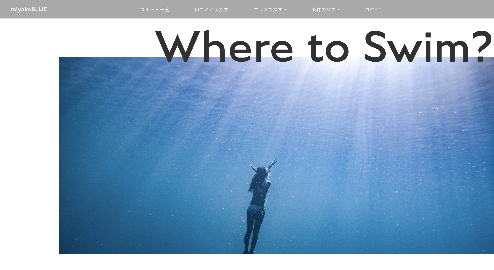
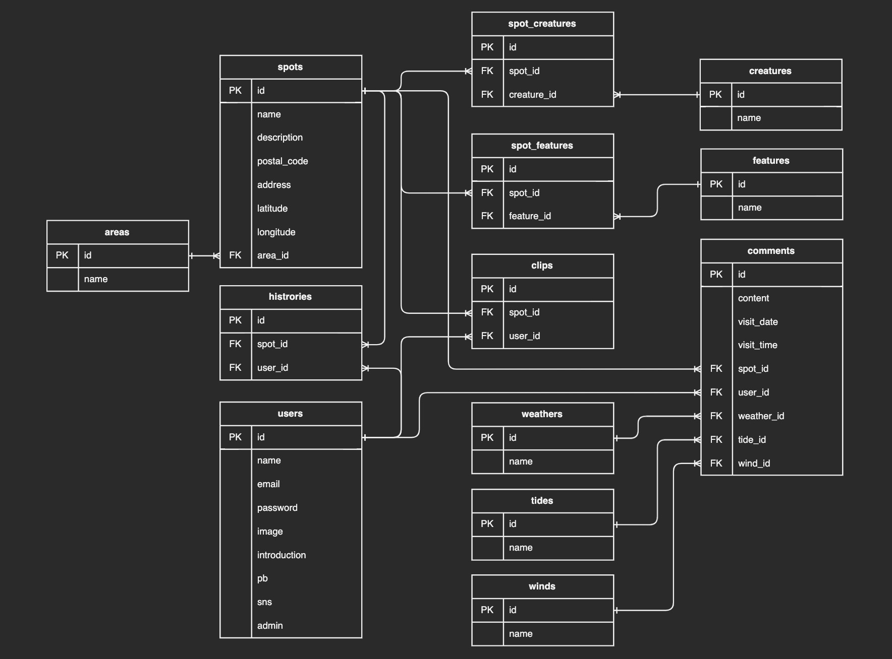

# 宮古ブルー
宮古島のスキンダイビングスポットを探せるサイトです。  
口コミ機能で最新情報をシェアしたり、マイページ機能でダイビング記録を残せます。  
（スキンダイビング：酸素ボンベ等を使わずに一息で深く潜る素潜り・スポーツ・あそび）  
下記ページで公開中です。  
https://skindive-miyako.com/  

 

## アプリ概要
スキンダイビングスポットを様々な条件で探せたり、ダイビングログを残せるアプリです。  
- 沖縄県「宮古島」周辺のスキンダイビングスポットを検索できる  
- 当日の気象情報等を含む口コミ投稿機能を実装  
- 行ったスポット、気になるスポットをマイページで管理できる機能を実装  

 

## 機能
Ruby on Railsで制作したアプリです。
- スポット検索機能(エリア/会える生き物/地形)：スポットのあるエリア・出会える生き物・地形や周辺情報を軸に検索できます
- Twitterシェア機能：Twitterアイコンを押してスポット情報を簡単に共有できます
- スポット詳細情報
  - 地図：住所や名称のないスポットも座標によるピンポイントな位置を確認できます
  - 天気：スポットごとに当日と翌日の天気・風向き・風速を確認できます
- 口コミ機能
  - 投稿：訪問時刻・当日の天気・潮・風向きを含む口コミを投稿できます
  - 検索：訪問年月日・天気・潮・風向きを軸に口コミを検索できます
- マイページ機能：
  - 行ったスポット・行きたいスポットを一覧で確認できます
  - 自分の投稿した口コミが一覧表示でき、ダイビングログとして使えます

 

## 使い方
### スポット検索
1. 画面上部の「スポット一覧」「エリアで探す」「条件で探す」から選択
2. 該当するスポットをクリック

 

### 口コミ投稿
1. 画面右上の「ログイン」ボタンをクリック
2. テストユーザーで簡単ログイン（`※登録せずに機能を試したい方は こちら`をクリック）
3. 任意のスポットページに移動→口コミページ→`口コミを書く`をクリック
4. 当日の天気等を選択して投稿→口コミが反映される

 

## 使用技術等
- フロント
  - HTML｜Sass｜JavaScript（jQuery）
- バック
  - Ruby 2.7.2
  - Ruby on Rails 6.0.3.4 → 6.0.3.6
  - RSpec
- インフラ・開発環境
  - AWS（VPC｜EC2｜RDS｜S3｜IAM｜Route53｜ACM｜ALB）
  - Docker｜Docker-compose
  - MySQL 5.7
  - Git｜GitHub（ソースコード管理）
  - capistrano（自動デプロイ）

 

## ER図

 

## その他
現在も開発を継続しており、順次実装予定です。

 

## 作者
Mail: [ayama0605@gmail.com](mailto:ayama0605@gmail.com)
